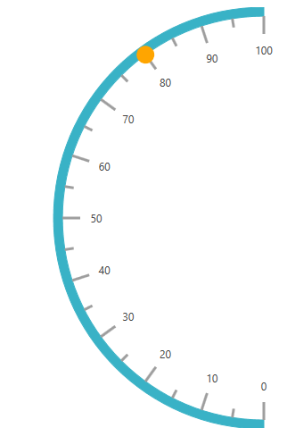
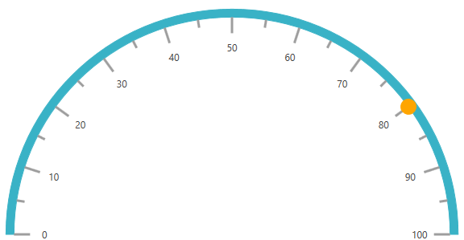

# How to create various directional semi circular gauge (SfCircularGauge) in WPF

This article explains how to create the various directional semi-circular gauge  using the StartAngle and SweepAngle properties of circular scale in WPF as shown in below.

## East directional semi-circular gauge

Set the StartAngle property as 270 and SweepAngle property as 180 to show in below

 

[XAML]

```
        <syncfusion:SfCircularGauge x:Name="gauge" GaugeType="North">
            <syncfusion:SfCircularGauge.Scales>
                <syncfusion:CircularScale   StartAngle="270" SweepAngle="180" >
                    <syncfusion:CircularScale.Pointers>
                        <syncfusion:CircularPointer x:Name="pointer" Value="80"
                                        PointerType="SymbolPointer" 
                                        Symbol="Ellipse"/>
                    </syncfusion:CircularScale.Pointers>
                </syncfusion:CircularScale>
            </syncfusion:SfCircularGauge.Scales>
        </syncfusion:SfCircularGauge>
```

## West directional semi-circular gauge

Set the StartAngle property as 90 and SweepAngle property as 180 to show in below.

 

 

[XAML]

```
        <syncfusion:SfCircularGauge x:Name="gauge" GaugeType="North">
            <syncfusion:SfCircularGauge.Scales>
                <syncfusion:CircularScale   StartAngle="90" SweepAngle="180" >
                    <syncfusion:CircularScale.Pointers>
                        <syncfusion:CircularPointer x:Name="pointer" Value="80"
                                        PointerType="SymbolPointer" 
                                        Symbol="Ellipse"/>
                    </syncfusion:CircularScale.Pointers>
                </syncfusion:CircularScale>
            </syncfusion:SfCircularGauge.Scales>
        </syncfusion:SfCircularGauge>
```

## North directional semi-circular gauge

Set the StartAngle property as 180 and SweepAngle property as 180 to show in below

  


[XAML]

```
          <syncfusion:SfCircularGauge x:Name="gauge" GaugeType="North">
            <syncfusion:SfCircularGauge.Scales>
                <syncfusion:CircularScale   StartAngle="180" SweepAngle="180" >
                    <syncfusion:CircularScale.Pointers>
                        <syncfusion:CircularPointer x:Name="pointer" Value="80"
                                        PointerType="SymbolPointer" 
                                        Symbol="Ellipse"/>
                    </syncfusion:CircularScale.Pointers>
                </syncfusion:CircularScale>
            </syncfusion:SfCircularGauge.Scales>
        </syncfusion:SfCircularGauge>
```

## South directional semi-circular gauge

Set the StartAngle property as 0 and SweepAngle property as 180 to show in below

 

 

[XAML]

```
        <syncfusion:SfCircularGauge x:Name="gauge" GaugeType="North">
            <syncfusion:SfCircularGauge.Scales>
                <syncfusion:CircularScale   StartAngle="0" SweepAngle="180" >
                    <syncfusion:CircularScale.Pointers>
                        <syncfusion:CircularPointer x:Name="pointer" Value="80"
                                        PointerType="SymbolPointer" 
                                        Symbol="Ellipse"/>
                    </syncfusion:CircularScale.Pointers>
                </syncfusion:CircularScale>
            </syncfusion:SfCircularGauge.Scales>
        </syncfusion:SfCircularGauge>
```
## See also

[How to add the scales in Xamarin Circular Gauge (SfCircularGauge)](https://help.syncfusion.com/xamarin/circular-gauge/scales)

[How to customize the rim in Xamarin Circular Gauge (SfCircularGauge)](https://help.syncfusion.com/xamarin/circular-gauge/rim)

[How to apply themes for SfCircularGauge](https://help.syncfusion.com/xamarin/circular-gauge/rim)

[How to bind scale collection to SfCircularGauge](https://www.syncfusion.com/kb/10578/how-to-bind-scale-collection-to-sfcirculargauge?_ga=2.222859803.1097610725.1597034638-1273195395.1560836863)

[How to set start and sweep angles for scale](https://www.syncfusion.com/kb/10567/how-to-set-start-and-sweep-angles-for-scale)

[How to bind scale collection to SfCircularGauge](https://www.syncfusion.com/kb/10578/how-to-bind-scale-collection-to-sfcirculargauge)

[How to customize Rim position for Scale](https://www.syncfusion.com/kb/8296/how-to-customize-rim-position-for-scale)


